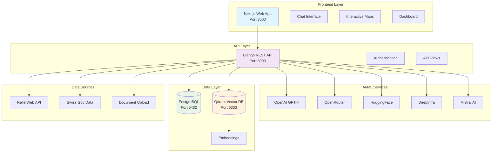
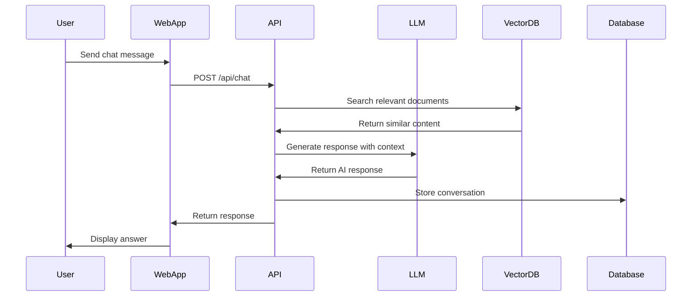
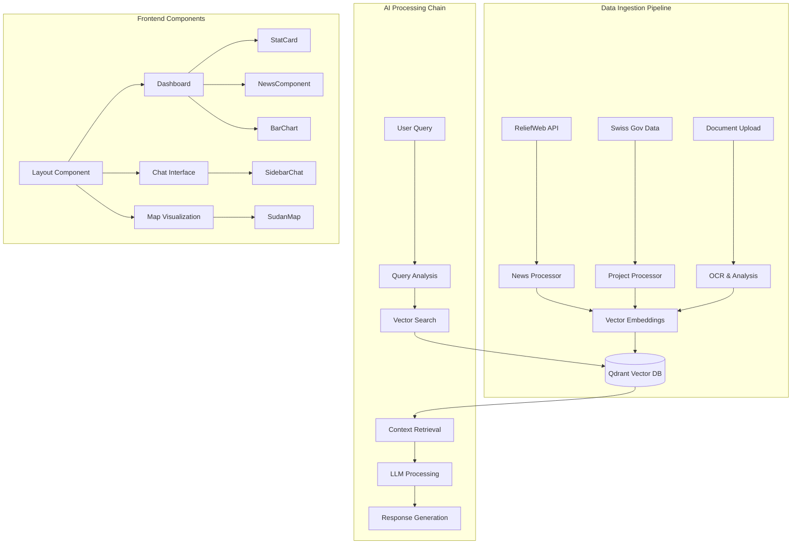

# 🇨🇭 Swiss AI Humanitarian Platform

> **AI-powered humanitarian assistance platform for Swiss development cooperation and crisis response**

[](https://opensource.org/licenses/MIT)
[](https://www.docker.com/)
[](https://www.python.org/downloads/)
[](https://nextjs.org/)

## 📋 Table of Contents

- [🎯 Overview](#-overview)
- [🏗️ Architecture](#️-architecture)
- [📁 Project Structure](#-project-structure)
- [🚀 Quick Start](#-quick-start)
- [🔧 Configuration](#-configuration)
- [🛠️ Technologies](#️-technologies)
- [📊 Features](#-features)
- [🔌 API Documentation](#-api-documentation)
- [🤝 Contributing](#-contributing)
- [📄 License](#-license)

## 🎯 Overview

The Swiss AI Humanitarian Platform is a comprehensive solution designed to enhance humanitarian assistance and development cooperation efforts. Built specifically for crisis response scenarios like the Sudan humanitarian crisis, it provides AI-powered tools for multilingual communication, document analysis, project mapping, and real-time information monitoring.

### Key Capabilities

- **🌍 Multilingual Support**: Arabic, English, French communication interfaces
- **📄 Document Intelligence**: OCR and semantic analysis of humanitarian reports
- **🗺️ Geospatial Visualization**: Interactive mapping of development projects
- **📰 Real-time Monitoring**: Automated ingestion of ReliefWeb and government sources
- **🔍 Semantic Search**: Vector-based search across humanitarian documents
- **💬 AI Chat Interface**: Context-aware assistance for humanitarian workers

## 🏗️ Architecture



### System Flow



## 📁 Project Structure

```
swiss-ai-humanitarian-platform/
├── 📁 django/                          # Backend API Service
│   ├── 📁 server/                       # Django project settings
│   │   ├── settings.py                  # Configuration & database setup
│   │   ├── urls.py                      # URL routing
│   │   └── wsgi.py                      # WSGI application
│   ├── 📁 vectorstore/                  # Main application
│   │   ├── 📁 llm/                      # AI/ML integrations
│   │   │   ├── openai_chat.py           # OpenAI GPT integration
│   │   │   ├── openai_embeddings.py     # OpenAI embeddings
│   │   │   ├── openrouter.py            # OpenRouter API client
│   │   │   ├── huggingface.py           # HuggingFace models
│   │   │   ├── qwen_embeddings.py       # Qwen embedding model
│   │   │   └── rate_limiter.py          # API rate limiting
│   │   ├── 📁 management/commands/      # Django management commands
│   │   │   ├── ingest_sources.py        # Data ingestion scripts
│   │   │   └── ingest_reliefweb_news.py # ReliefWeb data import
│   │   ├── models.py                    # Database models
│   │   ├── views.py                     # API endpoints
│   │   ├── ingest.py                    # Document processing
│   │   └── news_ingest.py               # News data processing
│   ├── requirements.txt                 # Python dependencies
│   └── Dockerfile                       # Container configuration
├── 📁 web/                              # Frontend Application
│   ├── 📁 app/                          # Next.js app router
│   │   ├── 📁 chat/                     # Chat interface pages
│   │   ├── 📁 ingest/                   # Data ingestion UI
│   │   ├── 📁 api/                      # API route handlers
│   │   ├── layout.tsx                   # Root layout
│   │   └── page.tsx                     # Homepage
│   ├── 📁 components/                   # React components
│   │   ├── 📁 dashboard/                # Dashboard widgets
│   │   │   ├── SudanMap.tsx             # Interactive map
│   │   │   ├── NewsComponent.tsx        # News display
│   │   │   ├── BarChart.tsx             # Data visualization
│   │   │   └── StatCard.tsx             # Statistics cards
│   │   ├── 📁 chat/                     # Chat components
│   │   └── 📁 ui/                       # UI primitives
│   ├── 📁 public/                       # Static assets
│   │   ├── logo.png                     # Swiss AI logo
│   │   └── sdadmbndaadm1.geojson        # Sudan administrative boundaries
│   ├── package.json                     # Node.js dependencies
│   └── Dockerfile                       # Container configuration
├── 📁 data_sources/                     # External data integration
│   ├── deza-scrapper.js                 # DEZA data scraping
│   ├── rlweb.js                         # ReliefWeb API client
│   ├── swiss-gov-suudan-projects.json   # Swiss government projects
│   ├── reliefweb_news_with_details.json # ReliefWeb news data
│   └── reliefweb_sudan_situation_reports.json # Situation reports
├── 📁 postgres/                         # Database initialization
│   └── 📁 init/
│       └── 000-enable-pgvector.sql      # Enable vector extension
├── docker-compose.yml                   # Multi-container orchestration
├── .env.example                         # Environment template
├── .gitignore                           # Git ignore rules
└── README.md                            # This file
```

### Component Hierarchy



## 🚀 Quick Start

### Prerequisites

- Docker & Docker Compose
- Git
- 8GB+ RAM recommended

### 1. Clone Repository

```bash
git clone https://github.com/0x4ym4n/swiss-ai-humanitarian-platform.git
cd swiss-ai-humanitarian-platform
```

### 2. Environment Setup

```bash
# Copy environment template
cp .env.example .env

# Edit with your API keys
nano .env
```

### 3. Launch Platform

```bash
# Start all services
docker-compose up -d

# View logs
docker-compose logs -f
```

### 4. Access Services

| Service | URL | Purpose |
|---------|-----|---------|
| **Web Interface** | http://localhost:3000 | Main application |
| **API Documentation** | http://localhost:8000/api | REST API endpoints |
| **Database** | localhost:5432 | PostgreSQL |
| **Vector Database** | localhost:6333 | Qdrant admin |

### 5. Initial Data Setup

```bash
# Ingest sample data
docker-compose exec api python manage.py ingest_sources
docker-compose exec api python manage.py ingest_reliefweb_news
```

## 🔧 Configuration

### Environment Variables

```bash
# API Keys (Required)
OPENAI_API_KEY=your_openai_api_key_here
OPENROUTER_API_KEY=your_openrouter_api_key_here
DEEPINFRA_API_KEY=your_deepinfra_api_key_here
MISTRAL_API_KEY=your_mistral_api_key_here
HF_TOKEN=your_huggingface_token_here

# Database Configuration
POSTGRES_DB=swissai
POSTGRES_USER=swiss
POSTGRES_PASSWORD=swisspassword

# Django Settings
DJANGO_SECRET_KEY=your_secret_key_here
DJANGO_DEBUG=1

# AI Model Configuration
DEEPINFRA_MODEL=Qwen/Qwen3-Embedding-0.6B
EMBEDDING_DIMENSIONS=1536
OPENAI_EMBED_MODEL=text-embedding-3-small

# Frontend Configuration
NEXT_PUBLIC_API_BASE_URL=http://localhost:8000
```

### Service Configuration

#### PostgreSQL + pgvector
- **Purpose**: Primary database with vector extension
- **Port**: 5432
- **Features**: User data, conversations, metadata

#### Qdrant Vector Database
- **Purpose**: Semantic search and embeddings storage
- **Port**: 6333, 6334
- **Features**: Document embeddings, similarity search

#### Django API Server
- **Purpose**: Backend API and data processing
- **Port**: 8000
- **Features**: REST APIs, AI integration, data ingestion

#### Next.js Web Application
- **Purpose**: Frontend user interface
- **Port**: 3000
- **Features**: React components, real-time chat, maps

## 🛠️ Technologies

### Backend Stack
- **🐍 Django 4.2**: Web framework and REST API
- **🐘 PostgreSQL 16**: Primary database with pgvector
- **🔍 Qdrant**: Vector database for semantic search
- **🤖 Multiple AI Providers**: OpenAI, OpenRouter, HuggingFace, DeepInfra, Mistral
- **🐳 Docker**: Containerization and orchestration

### Frontend Stack
- **⚛️ Next.js 13**: React framework with app router
- **🎨 Tailwind CSS**: Utility-first styling
- **📊 Recharts**: Data visualization
- **🗺️ Leaflet**: Interactive mapping
- **📱 TypeScript**: Type-safe development

### AI/ML Integration
- **OpenAI GPT-4**: Primary conversational AI
- **OpenAI Embeddings**: Text-to-vector conversion
- **OpenRouter**: Access to multiple AI models
- **HuggingFace**: Open-source model hosting
- **DeepInfra**: Scalable AI inference
- **Mistral AI**: European AI provider

### Data Sources
- **ReliefWeb API**: Humanitarian news and reports
- **Swiss Government**: Development cooperation data
- **Document Upload**: PDF/image processing with OCR
- **Manual Input**: User-generated content

## 📊 Features

### 🌐 Multilingual Chat Interface
- **Languages**: Arabic (العربية), English, French (Français)
- **Context-Aware**: Understands humanitarian terminology
- **Document Search**: Searches across uploaded documents
- **Real-time**: WebSocket-based communication

### 📄 Document Intelligence
- **OCR Processing**: Extract text from images and PDFs
- **Semantic Analysis**: Understand document meaning and context
- **Categorization**: Automatically tag and organize content
- **Search**: Vector-based similarity search

### 🗺️ Interactive Mapping
- **Sudan Focus**: Detailed administrative boundaries
- **Project Visualization**: Display Swiss development projects
- **Crisis Mapping**: Show humanitarian situation data
- **Real-time Updates**: Live data integration

### 📰 News Monitoring
- **ReliefWeb Integration**: Automatic news ingestion
- **Filtering**: Sudan-specific content prioritization
- **Analysis**: AI-powered content summarization
- **Alerts**: Important update notifications

### 🔍 Advanced Search
- **Vector Search**: Semantic similarity matching
- **Filters**: Date, source, type, language
- **Ranking**: Relevance-based result ordering
- **Export**: Results download functionality

## 🔌 API Documentation

### Authentication
```bash
# Most endpoints require API authentication
curl -H "Authorization: Bearer YOUR_TOKEN" \
     http://localhost:8000/api/endpoint
```

### Chat Endpoints

#### Send Message
```http
POST /api/chat/
Content-Type: application/json

{
  "message": "What's the current situation in Sudan?",
  "language": "en",
  "context_limit": 5
}
```

#### Response Format
```json
{
  "response": "Based on recent reports...",
  "sources": [
    {
      "title": "Sudan Situation Report",
      "url": "https://reliefweb.int/...",
      "relevance": 0.89
    }
  ],
  "conversation_id": "uuid-here"
}
```

### Document Endpoints

#### Upload Document
```http
POST /api/documents/upload/
Content-Type: multipart/form-data

file: document.pdf
language: en
category: report
```

#### Search Documents
```http
GET /api/documents/search/?q=humanitarian+aid&limit=10
```

### Data Ingestion Endpoints

#### Ingest ReliefWeb Data
```http
POST /api/ingest/reliefweb/
Content-Type: application/json

{
  "country": "sudan",
  "limit": 100,
  "date_from": "2024-01-01"
}
```

#### Project Data
```http
GET /api/projects/?country=sudan&status=active
```

### System Status
```http
GET /api/health/
```

```json
{
  "status": "healthy",
  "services": {
    "database": "connected",
    "vector_db": "connected",
    "ai_services": "available"
  },
  "version": "1.0.0"
}
```

## 🧪 Development

### Local Development Setup

```bash
# Backend development
cd django
pip install -r requirements.txt
python manage.py runserver

# Frontend development
cd web
npm install
npm run dev

# Database setup
docker-compose up db qdrant -d
python manage.py migrate
```

### Testing

```bash
# Backend tests
cd django
python manage.py test

# Frontend tests
cd web
npm run test

# Integration tests
docker-compose -f docker-compose.test.yml up
```

### Code Quality

```bash
# Python linting
cd django
black .
flake8 .
mypy .

# JavaScript/TypeScript linting
cd web
npm run lint
npm run type-check
```

## 🚀 Deployment

### Production Environment

```bash
# Production docker-compose
docker-compose -f docker-compose.prod.yml up -d

# Environment variables
cp .env.example .env.production
# Edit production values
```

### Scaling Considerations

- **Load Balancing**: Use nginx for multiple API instances
- **Database**: Consider read replicas for high traffic
- **Vector DB**: Qdrant clustering for large document sets
- **AI APIs**: Implement request queuing and retries
- **Monitoring**: Add health checks and logging

### Security

- **API Keys**: Store in secure key management system
- **Database**: Use SSL connections in production
- **Authentication**: Implement proper user authentication
- **HTTPS**: Use SSL certificates for web traffic
- **Network**: Restrict database access to application only

## 🤝 Contributing

We welcome contributions to improve the Swiss AI Humanitarian Platform!

### Getting Started

1. **Fork** the repository
2. **Create** a feature branch (`git checkout -b feature/amazing-feature`)
3. **Commit** your changes (`git commit -m 'Add amazing feature'`)
4. **Push** to the branch (`git push origin feature/amazing-feature`)
5. **Open** a Pull Request

### Development Guidelines

- Follow existing code style and conventions
- Add tests for new functionality
- Update documentation for new features
- Ensure all tests pass before submitting
- Keep commits focused and atomic

### Areas for Contribution

- **🌍 Internationalization**: Add more language support
- **📊 Analytics**: Enhanced data visualization
- **🔒 Security**: Security audits and improvements
- **📱 Mobile**: Mobile-responsive enhancements
- **🤖 AI Models**: Integration with new AI providers
- **📄 Documentation**: Tutorials and examples

## 📄 License

This project is licensed under the MIT License - see the [LICENSE](LICENSE) file for details.

## 🙏 Acknowledgments

- **Swiss Development Cooperation** for humanitarian mission inspiration
- **ReliefWeb** for providing open humanitarian data APIs
- **Open Source Community** for the amazing tools and libraries
- **AI Providers** for making advanced AI accessible

---

<div align="center">

**Built with ❤️ for humanitarian assistance and development cooperation**

[🌐 Live Demo](https://swiss-ai-humanitarian-platform.vercel.app) | [📚 Documentation](https://docs.swiss-ai.org) | [🐛 Report Issues](https://github.com/0x4ym4n/swiss-ai-humanitarian-platform/issues)

</div>